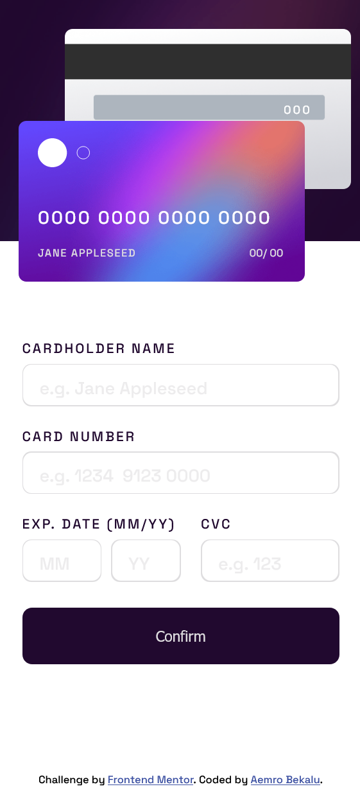

# Frontend Mentor - Interactive card details form solution

This is a solution to the [Interactive card details form challenge on Frontend Mentor](https://www.frontendmentor.io/challenges/interactive-card-details-form-XpS8cKZDWw). Frontend Mentor challenges help you improve your coding skills by building realistic projects.

## Table of contents

- [Overview](#overview)
  - [The challenge](#the-challenge)
  - [Screenshot](#screenshot)
  - [Links](#links)
- [My process](#my-process)
  - [Built with](#built-with)
  - [What I learned](#what-i-learned)
  - [Continued development](#continued-development)
  - [Useful resources](#useful-resources)
- [Author](#author)
- [Acknowledgments](#acknowledgments)

**Note: Delete this note and update the table of contents based on what sections you keep.**

## Overview

### The challenge

Users should be able to:

- Fill in the form and see the card details update in real-time
- Receive error messages when the form is submitted if:
  - Any input field is empty
  - The card number, expiry date, or CVC fields are in the wrong format
- View the optimal layout depending on their device's screen size
- See hover, active, and focus states for interactive elements on the page

### Screenshot

-desktop-solution


-mobile-solution


### Links

- Solution URL: [Add solution URL here](https://your-solution-url.com)
- Live Site URL: [Add live site URL here](https://your-live-site-url.com)

## My process

### Built with

- Semantic HTML5 markup
- CSS custom properties
- Flexbox
- CSS Grid
- Mobile-first workflow
- [React](https://reactjs.org/) - JS library
- [Next.js](https://nextjs.org/) - React framework
- [Styled Components](https://styled-components.com/) - For styles

**Note: These are just examples. Delete this note and replace the list above with your own choices**

### What I learned

in this challenge I have learned how can I validate a form by creating a function.
for example:- if we have an input field inside the form field. to validate the input field first we have to select them first in javascript.

```html
<!--input cardholdername-->
<input
  type="text"
  name="cardholder-name"
  id="name"
  placeholder="e.g. Jane Appleseed"
  aria-invalid="false"
/>

<!--input card number-->
<input
  type="text"
  name="card-number"
  id="number"
  placeholder="e.g. 1234  9123 0000 "
  aria-invalid="false"
/>
```

```js
/*selecting input element*/
const nameField = document.querySelector('input[name="cardholder-name"]');
const NumberField = document.querySelector('input[name="card-number"]');

/*creating validators for each input*/
//first validator: it will return the error text if the input value is equal to the empty string
function validateRequried(value) {
  return value === "" ? `fill the blank` : null;
}

//if the input value is not matches the regex expression which matches only for number digit it will return the error text it it matches it will return null
function validateNumeric(value) {
  return /^[\d]+$/.test(value) ? null : "Wrong format, numbers only";
}

//if the input value is between the minimum and the maximum it will return null otherwise it  will return the error text
function validateBetween(min, max) {
  return function (value) {
    return value < min || value > max ? "out of bounds" : null;
  };
}

// array associating the fields with the specific set of validators
//we store the inputfields and the types of validator which we want to apply to each field inside of the object
const fields = [
  { element: nameField, validators: [validateRequried] },
  {
    element: NumberField,
    validators: [validateRequried, validateNumeric],
  },
  {
    element: expMonthField,
    validators: [validateRequried, validateNumeric, validateBetween(1, 12)],
  },
  {
    element: expYearFeild,
    validators: [validateRequried, validateNumeric],
  },
  {
    element: cvcField,
    validators: [validateRequried, validateNumeric],
  },
];

//submit handler
//when the user submits the form the code will loop through each element of the field array and for each iteration we pass the inputfield value and the validator which we create for each input fields to the validateField function then it will store the first error which is returned from the validate field function in the fieldError variable then if the fieldError contains value which means the error text,it will push that error in the formError array  and it will show that error using the showError function . if the formError array length is equal to 0 which means if the form is valid it will show the thankyou card.
form.addEventListener("submit", (event) => {
  event.preventDefault();
  const formErrors = [];

  for (const field of fields) {
    //calling the validate function on the value of the input
    const fieldError = validateField(field.validators, field.element.value);

    if (fieldError) {
      formErrors.push(fieldError);
      showError(field.element, fieldError);
    } else {
      hideErrorMessage(field.element);
    }
  }

  //when form is valid
  if (formErrors.length === 0) {
    thankyouCard.classList.remove("hidden");
    form.classList.add("hidden");
  }
});

// Run a set of validators on a value, return the first error message found
//it will loop through the validators argument array and  it will return the first error which it gets from the validators function if it doesn't get an error it will the null
function validateField(validators, value) {
  for (const validator of validators) {
    const error = validator(value);
    if (error) return error;
  }

  return null;
}
```

### Continued development

Now I am studying javascript. I will continue studying javascript and do the challenges which help me to understand the concepts of the javascript

## Author

- Frontend Mentor - [@aemrobe](https://www.frontendmentor.io/profile/aemrobe)
- Twitter - [@Aemro112](https://www.twitter.com/Aemro112)

## Acknowledgments

I want to says thanks to @AlexKMarshall from frontendmentor it gives me a better way on how can I validate a form field.
